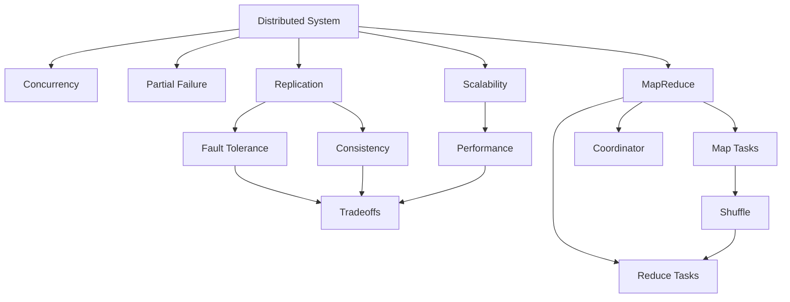

```mermaid
graph TD
    A[Distributed System] --> B[Concurrency]
    A --> C[Partial Failure]
    A --> D[Scalability]
    A --> E[Replication]
    E --> F[Fault Tolerance]
    E --> G[Consistency]
    D --> H[Performance]
    F --> I[Tradeoffs]
    G --> I
    H --> I
    A --> J[MapReduce]
    J --> K[Map Tasks]
    J --> L[Reduce Tasks]
    K --> M[Shuffle]
    M --> L
    J --> N[Coordinator]
```
