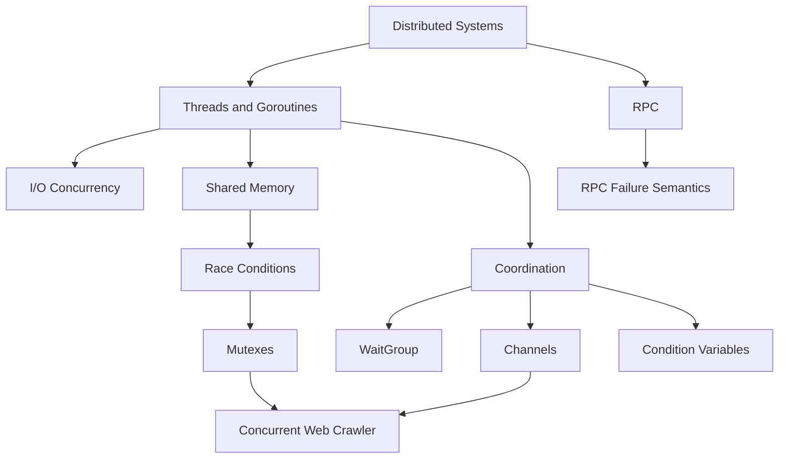

```mermaid
graph TD
    A[Distributed Systems] --> B[Threads and Goroutines]
    B --> C[I/O Concurrency]
    B --> D[Shared Memory]
    D --> E[Race Conditions]
    E --> F[Mutexes]
    B --> G[Coordination]
    G --> H[WaitGroup]
    G --> I[Channels]
    G --> J[Condition Variables]
    F --> K[Concurrent Web Crawler]
    I --> K
    A --> L[RPC]
    L --> M[RPC Failure Semantics]
```
