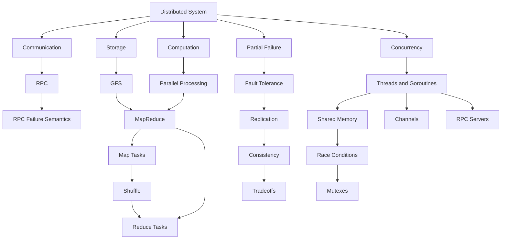

```mermaid
graph TD
    A[Distributed System] --> B[Communication]
    A --> C[Storage]
    A --> D[Computation]
    A --> E[Partial Failure]
    E --> F[Fault Tolerance]
    F --> G[Replication]
    G --> H[Consistency]
    H --> I[Tradeoffs]
    D --> J[Parallel Processing]
    J --> K[MapReduce]
    C --> L[GFS]
    L --> K
    K --> M[Map Tasks]
    K --> N[Reduce Tasks]
    M --> O[Shuffle]
    O --> N
    A --> P[Concurrency]
    P --> Q[Threads and Goroutines]
    Q --> R[Shared Memory]
    R --> S[Race Conditions]
    S --> T[Mutexes]
    Q --> U[Channels]
    Q --> V[RPC Servers]
    B --> W[RPC]
    W --> X[RPC Failure Semantics]
```
