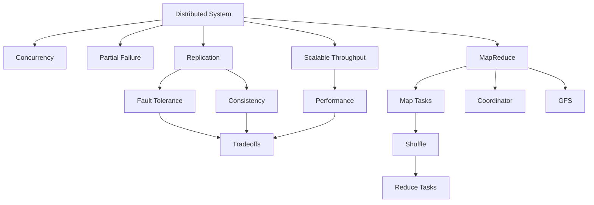

### 1. Topic Overview

- What is this about? Lecture 1 introduces distributed systems and uses MapReduce as the first case study.
- Why does it matter? Modern storage, web apps, databases, cloud services, and big-data systems all rely on many machines working together.
- Difficulty: beginner to intermediate.
- Prerequisites: basic programming, files, functions, concurrency, hash tables, and client/server communication.

### 2. Core Concepts

#### Distributed System

- Definition: A group of computers cooperating to provide one service.
- Intuition: Instead of one big machine doing everything, many machines split the work.
- Example: A messaging app may use many backend servers for login, message storage, notifications, and search.
- Common mistakes: Thinking "distributed" only means "on the internet"; the key idea is cooperation among machines.

#### Partial Failure

- Definition: Some parts of the system fail while others keep running.
- Intuition: In one program, a crash usually stops everything. In a distributed system, one server can die while others still respond.
- Example: One MapReduce worker crashes, but the coordinator and other workers continue.
- Common mistakes: Assuming failure is all-or-nothing; assuming a slow machine is obviously dead.

#### Fault Tolerance

- Definition: The system keeps working despite failures.
- Intuition: If one copy or worker fails, another copy or worker takes over.
- Example: GFS stores replicas of data chunks on multiple servers, so data survives a server crash.
- Common mistakes: Thinking fault tolerance is free; it usually costs communication, storage, and coordination.

#### Consistency

- Definition: A rule for what results users should see, especially after reads and writes.
- Intuition: If you write x = 5, should every later read immediately return 5?
- Example: Replicated servers must agree on the latest value of x.
- Common mistakes: Thinking replication automatically gives consistency; replicas can diverge unless carefully coordinated.

#### Performance and Scalability

- Definition: Performance is how fast the system works; scalability is whether adding machines increases total capacity.
- Intuition: If 10 machines do 10 times the work of 1 machine, the system scales well.
- Example: Map tasks can run independently, so many workers can process many input splits in parallel.
- Common mistakes: Assuming more machines always help; bottlenecks like network traffic or stragglers can dominate.

#### MapReduce

- Definition: A programming model for large batch computations using Map and Reduce functions.
- Intuition: Map extracts useful intermediate facts; Reduce groups facts with the same key and combines them.
- Example: Word count maps each word to (word, 1), then reduces each word's list of 1s into a total count.
- Common mistakes: Treating MapReduce as general-purpose computation; it only fits certain data-flow patterns.

#### Coordinator

- Definition: The MapReduce component that assigns tasks, tracks progress, and restarts failed work.
- Intuition: It is the manager that decides which worker does which task.
- Example: If a worker crashes during a map task, the coordinator schedules that map task again elsewhere.
- Common mistakes: Forgetting the coordinator itself can be a single point of failure.

### 3. Deep Understanding

- Distributed systems are hard because machines run concurrently, communicate over networks, and fail independently.
- The course's main triangle is fault tolerance, consistency, and performance.
- These goals conflict:
  - Fault tolerance often needs replication.
  - Replication often needs coordination.
  - Coordination often hurts performance.
- MapReduce shows a practical tradeoff:
  - It restricts the programming model.
  - In return, it hides task scheduling, data movement, load balancing, and crash recovery.
- MapReduce works well because map tasks and reduce tasks are mostly independent.
- The expensive middle step is the shuffle, where intermediate data moves from map workers to reduce workers.
- Determinism matters: if a map task is re-run after failure, it must produce the same output.

### 4. Minimal Working Example

```text
Input:
  "cat dog cat"

Map function:
  for each word w:
      emit(w, 1)

Map output:
  (cat, 1)
  (dog, 1)
  (cat, 1)

Shuffle/group by key:
  cat -> [1, 1]
  dog -> [1]

Reduce function:
  for each key k and list v:
      emit(k, sum(v))

Final output:
  cat -> 2
  dog -> 1
```

Execution flow:

- Input is split into pieces.
- Workers run Map on different pieces in parallel.
- Intermediate key-value pairs are partitioned by key.
- Reduce workers fetch their partition from all map workers.
- Each reducer combines values for one group of keys.
- Final output is written to distributed storage.

### 5. Knowledge Graph



### 6. Self-Test Questions

Recall:

1. What is a distributed system?
2. Why is partial failure harder than normal program failure?
3. What are the two programmer-defined functions in MapReduce?

Application:

1. In word count, what key-value pairs would Map emit for "a b a"?
2. If a MapReduce worker crashes after finishing a map task but before reducers fetch its output, what should the coordinator do?

Explain like I am 5:

1. Explain MapReduce using a classroom of students counting colored blocks.

### 7. Weak Point Detection

- Learners often confuse distributed systems with ordinary internet apps.
- Learners often miss why partial failure is harder than total failure.
- Learners often think replication automatically solves consistency.
- Learners often forget that Map and Reduce should be deterministic.
- Learners often underestimate the shuffle as a network bottleneck.

### Learning Loop Prompt

Explain this back: What is MapReduce, and why does it help with large-scale computation?
