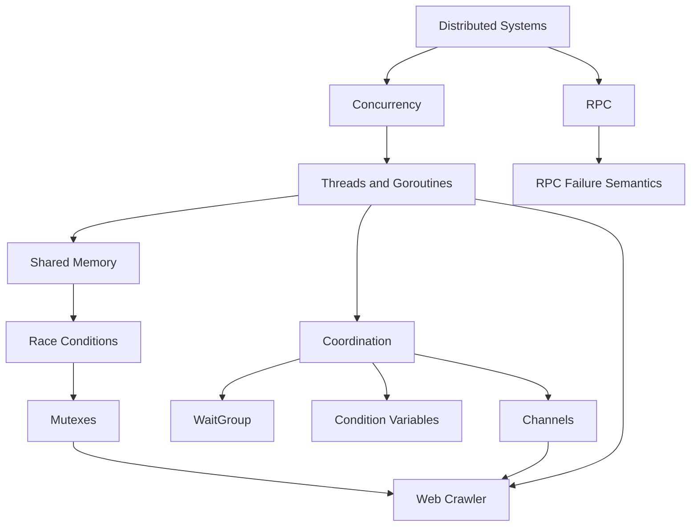

### 1. Topic Overview

- Topic: MIT 6.5840 Lecture 2 - Threads and RPC.
- What this is about: using Go concurrency and RPC as basic tools for building distributed systems.
- Why it matters: distributed systems must do many things at once, safely share state, coordinate work, and communicate across machines.
- Difficulty level: intermediate.
- Prerequisites:
  - Basic Go syntax: functions, structs, methods, maps.
  - Basic distributed systems ideas: multiple computers, communication, partial failure.
  - Basic MapReduce context from Lecture 1.

### 2. Core Concepts

#### Concept: Threads and Goroutines

- Definition: A thread is one sequence of execution inside a program. Go calls lightweight threads goroutines.
- Intuition: One program can handle many tasks at the same time instead of waiting for each one to finish before starting the next.
- Example: A web crawler can fetch many URLs in parallel while waiting for network replies.
- Common mistakes:
  - Thinking a goroutine automatically makes code safe.
  - Forgetting that goroutines can access the same memory at the same time.

#### Concept: Why Threads Are Useful

- Definition: Threads help with I/O concurrency, multicore parallelism, and background tasks.
- Intuition: If one task is waiting for disk, network, or RPC, another task can run.
- Example: A server can process request B while request A waits for disk I/O.
- Common mistakes:
  - Equating concurrency with speedup in every case.
  - Forgetting that coordination overhead can reduce benefits.

#### Concept: Race Conditions

- Definition: A race occurs when two goroutines access the same memory at the same time and at least one access is a write.
- Intuition: The final result depends on timing, so the program may work sometimes and fail other times.
- Example: Two goroutines both see `fetched[url] == false`, then both fetch the same URL.
- Common mistakes:
  - Believing races are harmless if output usually looks correct.
  - Protecting some accesses with a lock but forgetting other accesses.

#### Concept: Mutex and Critical Section

- Definition: A mutex allows only one goroutine at a time to enter a protected section of code.
- Intuition: Put a lock around the check-and-update that must happen as one indivisible action.
- Example: `testAndSet(url)` locks, checks whether the URL was fetched, marks it fetched, then unlocks.
- Common mistakes:
  - Locking only the read but not the write.
  - Forgetting to unlock, causing deadlock.
  - Assuming Go automatically links a lock to a variable. It does not.

#### Concept: Coordination and Waiting

- Definition: Coordination lets one goroutine wait for another goroutine's progress or result.
- Intuition: Threads often need to know when work is done or when data is available.
- Example: `sync.WaitGroup` waits until all child goroutines call `Done()`.
- Common mistakes:
  - Busy waiting in a loop and wasting CPU.
  - Waiting while holding a lock that other goroutines need.

#### Concept: Channels

- Definition: A channel lets goroutines send values to each other while also synchronizing.
- Intuition: Instead of sharing a map directly, workers can send completed results to a coordinator.
- Example: A crawler worker sends a slice of discovered URLs on `ch`, and the coordinator receives it.
- Common mistakes:
  - Forgetting that an unbuffered send waits for a receiver.
  - Creating deadlock by having all goroutines wait with nobody able to proceed.

#### Concept: Condition Variables

- Definition: A condition variable lets a goroutine sleep until another goroutine signals that shared state may have changed.
- Intuition: The waiter says, "wake me when the condition might be true," then rechecks the condition under the lock.
- Example: In vote counting, workers update `count` and `finished`, then call `cond.Broadcast()`.
- Common mistakes:
  - Using `if` instead of a loop around `cond.Wait()`.
  - Forgetting that `Wait()` releases the lock while sleeping and reacquires it before returning.

#### Concept: Web Crawler Designs

- Definition: The lecture compares serial crawling, concurrent crawling with locks, and concurrent crawling with channels.
- Intuition: The same problem can be solved by shared state plus locks or by message passing.
- Example:
  - Serial: one page at a time.
  - Mutex version: many goroutines share and lock `fetched`.
  - Channel version: workers send URL lists to a single coordinator.
- Common mistakes:
  - Adding `go` to recursive calls without knowing when the program is done.
  - Sharing a map from multiple goroutines without synchronization.

#### Concept: RPC

- Definition: Remote Procedure Call lets a client call a function-like operation on a server over a network.
- Intuition: The client writes `Call("KV.Get", args, reply)`, while the RPC library handles request encoding, network transfer, dispatch, and reply decoding.
- Example: `KV.Put` stores a key-value pair; `KV.Get` reads it from the server.
- Common mistakes:
  - Treating RPC exactly like a local function call.
  - Forgetting server handlers may run concurrently and need locks.

#### Concept: RPC Failures and Semantics

- Definition: RPC failures happen when the client does not receive a response, but cannot know exactly whether the server executed the operation.
- Intuition: No reply may mean the request was lost, the server crashed, the response was lost, or the server was just slow.
- Example: Retrying `Put("k", 10)` after a timeout may cause duplicate or reordered operations.
- Common mistakes:
  - Assuming retrying is always safe.
  - Confusing best-effort with exactly-once behavior.
  - Forgetting that read-only or idempotent operations are easier to retry.

### 3. Deep Understanding

Threads are useful because distributed systems are full of waiting: network requests, disk reads, RPC replies, and background health checks. A single-threaded program can still interleave work with an event loop, but the programmer must manually track each activity's state. Goroutines let each activity look like ordinary sequential code.

The cost is shared-memory danger. If goroutines can read and write the same data, the programmer must decide how to protect it. A mutex works when the program is organized around shared state. Channels work when the program is organized around communication. Both can solve many of the same problems, but they push the design in different directions.

RPC extends the same concurrency and failure questions across machines. Server-side RPC handlers commonly run in separate goroutines, so server state needs locks. Client-side RPC also introduces uncertainty: unlike a local function call, a failed RPC may have executed on the server even if the client never saw the result.

### 4. Minimal Working Example

```go
type KV struct {
    mu   sync.Mutex
    data map[string]string
}

func (kv *KV) Put(args *PutArgs, reply *PutReply) error {
    kv.mu.Lock()
    defer kv.mu.Unlock()
    kv.data[args.Key] = args.Value
    return nil
}
```

Execution flow:

- The RPC library receives a client request for `KV.Put`.
- It runs the handler, potentially in parallel with other handlers.
- The handler locks `kv.mu` before touching the shared map.
- It updates the map and unlocks with `defer`.
- Without the lock, two RPC handlers could access the map concurrently and corrupt state or crash.

### 5. Knowledge Graph



### 6. Self-Test Questions

Recall:

1. What is a goroutine?
2. What is a race condition?
3. What two things does a channel do in Go?

Application:

1. In the crawler, why must checking `fetched[url]` and setting `fetched[url] = true` be protected together?
2. Why does the key/value server lock around both `Get` and `Put` handlers?

Explain like I am 5:

1. Explain why an RPC call can fail even though the server may have already done the work.

### 7. Weak Point Detection

- Learners often confuse concurrency with correctness: making many goroutines does not automatically make shared data safe.
- Learners often miss the check-then-set race: the bug is not just the map write, but the gap between checking and marking.
- Learners often think channels are only for sending data, but channels also make goroutines wait for each other.
- Learners often treat RPC like a local function call, ignoring uncertainty after timeout or network failure.
- Learners often forget that server-side RPC handlers can run concurrently, so server state must be protected.
